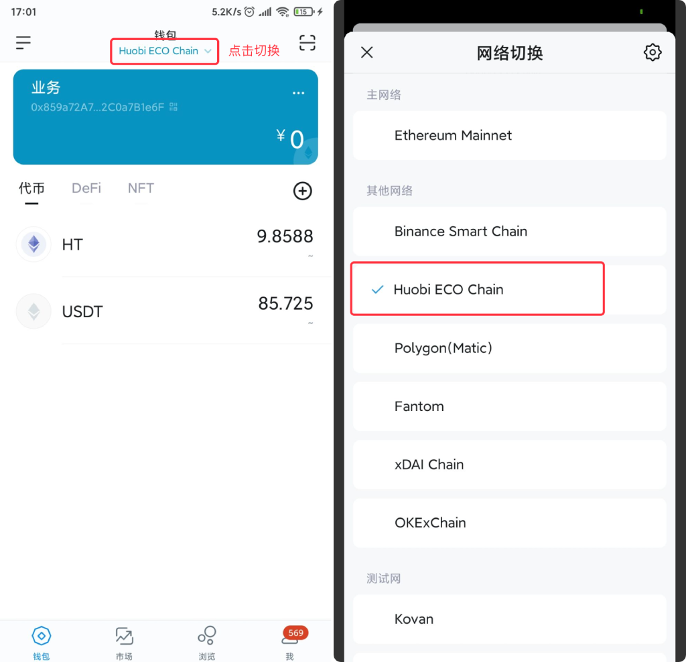
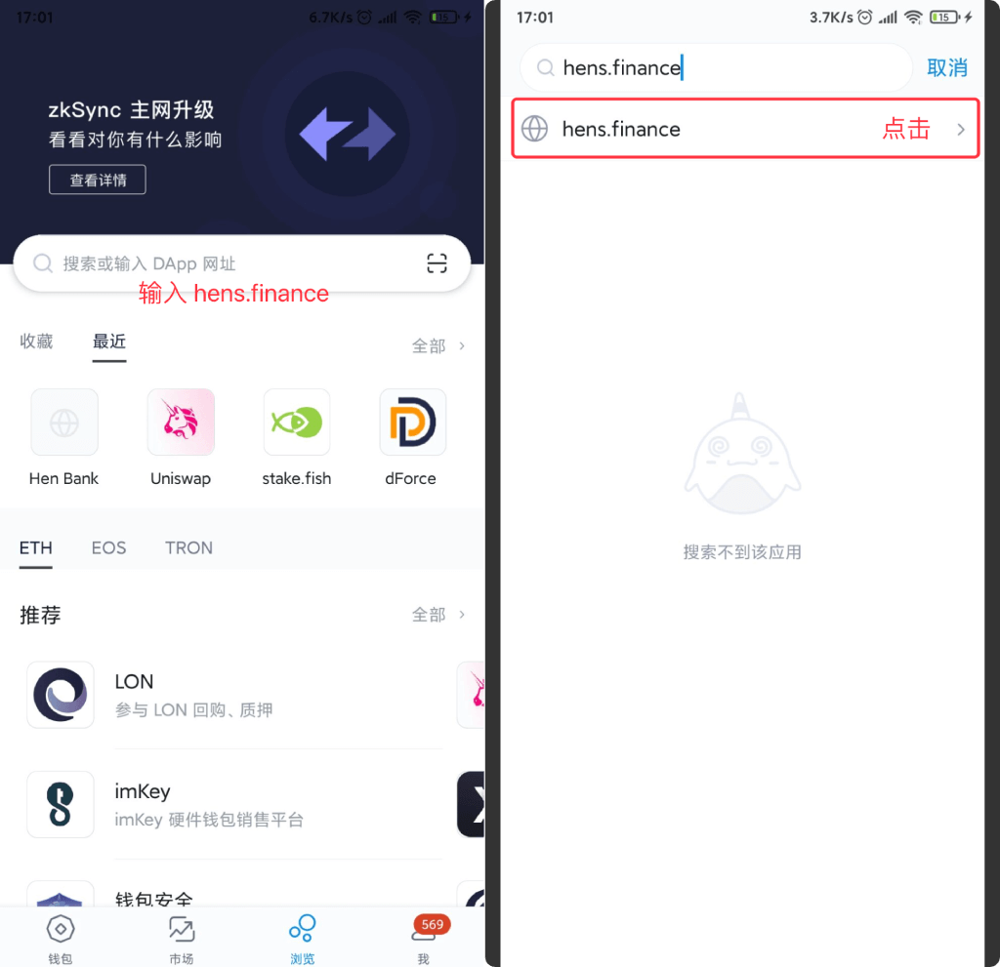

# 三、下载钱包

## 火币钱包 

下载钱包 [https://www.hecochain.com/zh-cn/wallet](https://www.hecochain.com/zh-cn/wallet) 确保，选择的是 Heco  

点击底部”DApp”，在搜索框，搜索“hens.finance”

## IMTOKEN 

下载钱包 [https://token.im/](https://token.im/)

切换网络

点击底部“浏览”，搜索输入“hens.finance”

